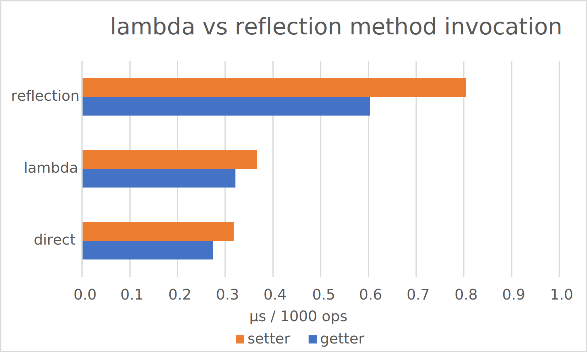

# lambda-vs-classic-reflection-benchmark
Comparing dynamic method invocation performance between lambda proxies and classic reflection.

## Motivation
One common use case, when working with JavaBeans or POJOs or DTOs etc., is dynamic access to its properties.
According to the JavaBeans standard, a property is a mere member variable of a class (a.k.a. field), which has a getter and a setter method.
Most Java template engines (JSP, FreeMarker, Thymeleaf, Velocity, etc.) or Java frameworks with XML configuration (Spring, Hibernate ORM) reference properties by its names.
These property names are parsed into Java strings, which are then used to find and later invoke the corresponding getter and setter methods.

A line of code is worth a thousand words, hence let's look at the following example:
```java
// A simple JavaBean:
public class MyBean implements java.io.Serializable {
  private String str;
  public String getStr() { return str; }
  public void setStr(String str) { this.str = str; }
}
```
The challenge is that getter/setter method calls are not known until runtime.
Applications obviously read configuration files and templates on startup or on demand.
If your bean properties are known at compile time, you may end up with something like a huge switch statement for each property:
```java
static void setProperty(MyBean myBean, String property, String value) {
  switch(property) {
    case "str":
      myBean.setStr(value);
      break;
    // and so on for further properties
  }
}
```
If our data model counts hundreds or thousands of diffrent beans, such approach may quickly become cumbersome.
In that case we would need to write similar methods for every bean class in our project.
This can be somewhat mitigated by using code generation, still a controversial issue on its own.
However, the whole solution won't work, if we are writing a library and obviously have no idea, what other developers' beans will look like.
Since getter and setter method naming follows a well defined convention, a better approach is to reconstruct the method name from the property name and find the corresponding getter or setter reflectively.
As a result we get a reference to the method, which can be later used to invoke it.
Java provides more than one way to perform a method call using method references.
In the following we will present two major approaches of invoking the `getStr()` and `setStr(String)` methods dynamically at runtime.

### Getters and Setters via Reflection
The package `java.beans` provides useful utilities for finding getters and setters by property name using Java reflection API.
Given the property `"str"` and `MyBean` class reference, we can instantiate a new `java.beans.PropertyDescriptor` object:
```java
java.beans.PropertyDescriptor pd = new java.beans.PropertyDescriptor("str", MyBean.class);
```
`PropertyDescriptor` contains logic for resolving methods according to the JavaBeans standard. By calling the object methods `PropertyDescriptor.getReadMethod()` and `PropertyDescriptor.getWriteMethod()` we get a getter and a setter method reference respectively:
```java
java.lang.reflect.Method getter = pd.getReadMethod();
java.lang.reflect.Method setter = pd.getWriteMethod();
```
FInally, reflective method invocation would look like this:
```java
String str = (String) getter.invoke(myBean);
setter.invoke(myBean, "new value");
```
We can also cache these method references if `MyBean` is expected to be used often, so that we don't need to find these methods via `PropertyDescriptor` each time we access its properties.
This approach was battle tested for decades and is found across myriads of prominent Java libraries.
However, reflective access comes at a cost.
Java reflection API has been surely optimized over the years of its existence, but there is still a certain overhead when compared to direct method calls.

### Getters and Setters via Lambda Proxies
So, now consider Java 8 lambda expressions.
Basically, any Java interface with a single method is eligible for a lambda function.
The package `java.util.function` contains many predefined interfaces for lambda functions to choose from.
For our getter method we need a method with a single parameter and a return value.
`java.util.function.Function` is hence a perfect match.
For the setter we need a method with *two* parameters, namely the bean and the value to set, but with no return value.
`java.util.function.BiConsumer` exactly suits our needs.
Let's create our lambda functions:
```java
java.util.function.Function<MyBean, String> getterProxy = myBean -> myBean.getStr();
java.util.function.BiConsumer<MyBean, String> setterProxy = (myBean, str) -> myBean.setStr(str);
```
Method invocation is also pretty simple:
```java
String str = (String) getterProxy.apply(myBean);
setterProxy.accept(myBean, "new value");
```
Such lambda proxy adds an extra layer to the method stack, but it must be performant enough, since lambdas are heavily used within the new Java APIs.
We can also cache these lambda references, for instance, in a map with the property names as keys.

By now you may already noticed, that we cheated by hardcoding the method calls into our lambda functions.
We didn't access the getter and the setter by the property name, hence we need to know the properties at compile time, which&mdash;as we already said before&mdash;is often infeasible.
It's no good, if we can't create our lambda functions for properties, which are first known at runtime.
If only there was some way to create lambdas dynamically...

Well, there is.
`java.lang.invoke.LambdaMetafactory` is able to create such proxies from method references.
We still need the `java.lang.reflect.Method` references to getters and setters, but this time they are only used for finding the methods, not their invocation.
Note that `LambdaMetafactory` doesn't "wrap" the reflective method call we've seen above, but creates a lambda function which directly calls the proxied method.
That's why we expect it to perform differently (i.e. faster) than the good old reflection API.
```java
import java.lang.function.*;
import java.lang.invoke.*;

// ...

java.beans.PropertyDescriptor pd = new java.beans.PropertyDescriptor("str", MyBean.class);
MethodHandles.Lookup lookup = MethodHandles.lookup();

// Getter proxy:
MethodHandle gHandle = lookup.unreflect(pd.getReadMethod());
MethodType gType = MethodType.methodType(Function.class);
MethodType gSignature = MethodType.methodType(Object.class, Object.class);
CallSite gCallSite = LambdaMetafactory.metafactory(lookup, "apply", gType, gSignature, gHandle, gHandle.type());
Function<Object, Object> getterProxy = (Function<Object, Object>) gCallSite.getTarget().invokeExact();

// Setter proxy:
MethodHandle sHandle = lookup.unreflect(pd.getWriteMethod());
MethodType sType = MethodType.methodType(BiConsumer.class);
MethodType sSignature = MethodType.methodType(Void.TYPE, Object.class, Object.class);
CallSite sCallSite = LambdaMetafactory.metafactory(lookup, "accept", sType, sSignature, sHandle, sHandle.type());
BiConsumer<Object, Object> setterProxy = (BiConsumer<Object, Object>) sCallSite.getTarget().invokeExact();
```
That's a pretty bulky construction up there, but we can simply pack this code in some (static) method and reuse it.
And, obviously, method/lambda invocation is absolutely identical to the example we've shown above.

Tiny remark: In our example above we also used the `java.lang.invoke.MethodHandle` API, first introduced in Java 7.
A `MethodHandle` itself may be used for method invocation in a similar manner to `java.lang.reflect.Method`.
Whereas `MethodHandles` are a powerful addition to the standard reflection API, it is currently outside of our scope to measure its performance.
With Java 9 onwards there were some performance optimizations for `MethodHandle` API, so a new benchmark with later Java versions should be performed in the future.

### Our Goal
We finally come to the point. Both approaches add some performance overhead to method invocation.
*We want to measure, which approach is faster: classic reflictive method access or indirect method call via dynamically created lambda proxy.*

## Results
```
Benchmark                                          Mode   Cnt  Score   Error  Units
LambdaVsReflectionBenchmark.benchDirectGetter      avgt  1000  0.274 ± 0.002  us/op
LambdaVsReflectionBenchmark.benchDirectSetter      avgt  1000  0.318 ± 0.001  us/op
LambdaVsReflectionBenchmark.benchLambdaGetter      avgt  1000  0.322 ± 0.001  us/op
LambdaVsReflectionBenchmark.benchLambdaSetter      avgt  1000  0.366 ± 0.002  us/op
LambdaVsReflectionBenchmark.benchReflectionGetter  avgt  1000  0.604 ± 0.004  us/op
LambdaVsReflectionBenchmark.benchReflectionSetter  avgt  1000  0.805 ± 0.005  us/op
```
Values are in microseconds per 1000 operations. *Lower is better.*
<p align="center">
  
</p>

### Hardware Specs
```
        CPU: Intel Core i5-7440HQ 2.80 GHz, 4 cores, HT off
        RAM: DDR4, 32 GByte, 1200 MHz
         OS: Windows 10 Home x64 20H2 19042.985
        JVM: JDK 1.8.0_292, OpenJDK 64-Bit Server VM, 25.292-b10
JVM options: <none>
```
